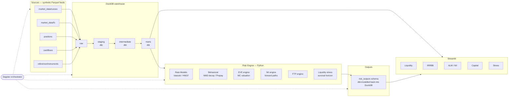

# Target Architecture — Basel ALM Risk Engine

## Positioning

A production-grade ALM/treasury risk engine demo. **Out of scope:** FRTB / market risk capital (deliberately avoided — author's day-job CoI). **In scope:** IRRBB under BCBS 368 / EBA Guidelines, liquidity (LCR, NSFR, ALMM survival horizon), ICAAP-flavored capital adequacy, behavioral modeling and FTP for NII.

## Stack

| Layer            | Choice                              | Why                                                            |
|------------------|-------------------------------------|----------------------------------------------------------------|
| Storage (raw)    | Parquet on local FS                 | Columnar, schema-on-read, lakehouse pattern                    |
| Warehouse        | DuckDB (single-file)                | OLAP-fast, dbt-native, zero ops, embeddable                    |
| Transformations  | dbt-duckdb                          | Lineage, tests, docs, conformed marts                          |
| Orchestration    | Dagster                             | Asset-centric DAG, typed I/O, dbt-native, modern local dev     |
| Risk engine      | Python (numpy/scipy + polars)       | Quant-readable, fast Parquet I/O, ready for JAX later          |
| UI               | Streamlit (Phase 3 upgrade)         | Existing — kept, repointed at DuckDB / risk_outputs            |
| Deferred         | FastAPI, Docker Compose, GH Actions | Phase 4 polish                                                 |

## Data flow



## Repo layout (target)

Flat top-level packages (no `packages/` wrapper) — simpler setuptools config, identical intent.

```
basel-risk-pipeline/
├── pyproject.toml                 # single source of truth for deps + packages
├── docs/
│   ├── ARCHITECTURE.md            # this file
│   └── ROADMAP.md
├── data/
│   ├── raw/                       # Parquet sources (gitignored)
│   ├── seed/                      # tiny committed sample for smoke / CI
│   └── warehouse.duckdb           # gitignored
├── basel_common/                  # shared types (pydantic), connection helper, enums, date utils
├── basel_ingestion/               # generate + load Parquet, DuckDB ingest
├── basel_risk_engine/             # rate models, behavioral, EVE/NII, FTP, liquidity (Phase 2)
├── src/                           # legacy compute.py / queries.py / scenario.py (Phase 0 keeps these)
├── dbt_project/                   # Phase 1
│   ├── dbt_project.yml
│   ├── profiles.yml
│   └── models/
│       ├── staging/
│       ├── intermediate/
│       └── marts/
│           ├── liquidity/
│           ├── irrbb/
│           ├── alm/
│           └── capital/
├── basel_dagster/                 # Phase 1 — flat layout (no dagster_project/ wrapper)
│   ├── assets/
│   │   ├── ingestion.py
│   │   └── transformations.py
│   ├── jobs.py
│   ├── schedules.py
│   ├── resources.py
│   └── definitions.py             # `dagster dev -m basel_dagster.definitions`
├── dashboard/                     # Streamlit, reads DuckDB
├── scripts/                       # run.cmd
└── tests/
    ├── risk_engine/
    ├── dbt/
    └── integration/
```

Once Phase 2 ships the risk engine and dbt absorbs the SQL-shaped compute, `src/` shrinks to dashboard glue (or empties entirely) and `compute.py` becomes a thin client over `basel_risk_engine` + dbt marts.

## Key design choices

- **DuckDB as both warehouse and serving layer.** Streamlit reads marts directly; no API needed. DuckDB is read-by-many-write-by-one — Streamlit opens it read-only, Dagster writes.
- **Risk engine outputs are dbt-modelled.** The Python engine writes results back as Parquet; dbt reads them as sources, applies tests, exposes as `risk_outputs.*` marts. Engine outputs get the same lineage/test treatment as raw data.
- **Asset-centric Dagster.** Each dbt model and each risk-engine output is a Dagster asset. The full DAG (raw → staging → intermediate → marts → risk_engine → risk_outputs → marts again) is visible in the Dagster UI.
- **No NMD project entanglement.** The behavioral layer here uses a simple parametric NMD decay curve. The standalone `NMD rates` Python/PyMC project is referenced in README as a possible future swap-in, not a dependency.
- **Synthetic-only data.** No vendor feeds, no scraped data — generators in `packages/ingestion` produce realistic Parquet from configurable parameters. Repro-friendly, no licensing risk.

## What this demonstrates to a quant ALM reviewer

- IRRBB done properly: not bps shocks on hardcoded gaps, but a **calibrated short-rate model** driving MC curve paths, with behavioral overlays (NMD repricing assumptions, embedded optionality) and EVE distributions — the EBA supervisory outlier test computed from a distribution, not a point.
- Liquidity beyond ratios: **multi-scenario survival horizon** (idiosyncratic / market-wide / combined), not just LCR.
- **FTP attribution** for NII — assigns cost of funds by behavioral bucket, distinguishing rate vs. volume vs. margin contributions.
- Reproducible, tested, orchestrated: dbt tests + risk-engine unit/property tests + Dagster asset checks. The kind of pipeline auditors can read.
